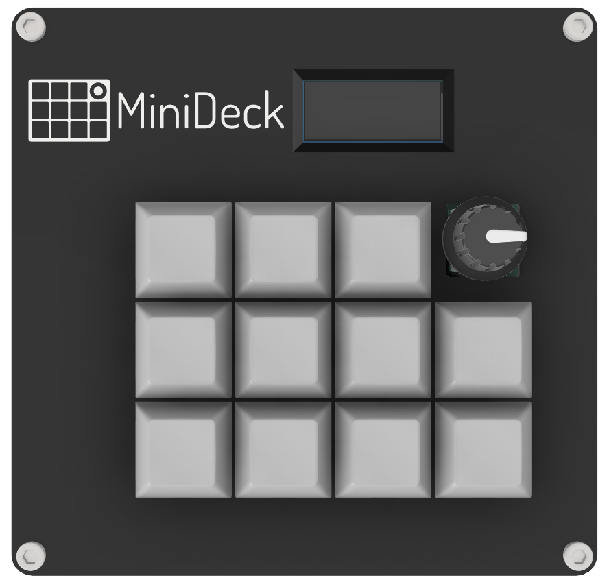
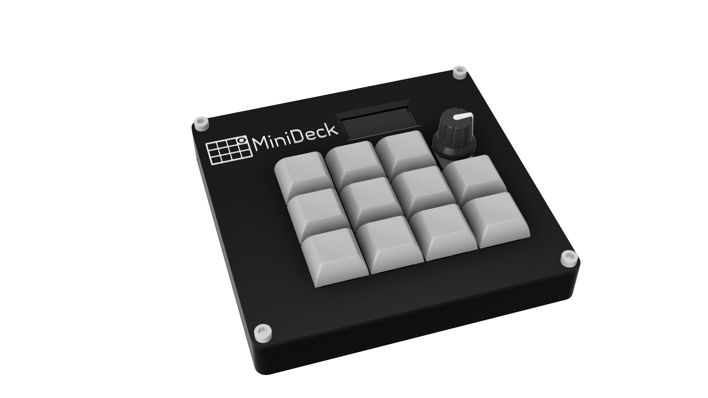
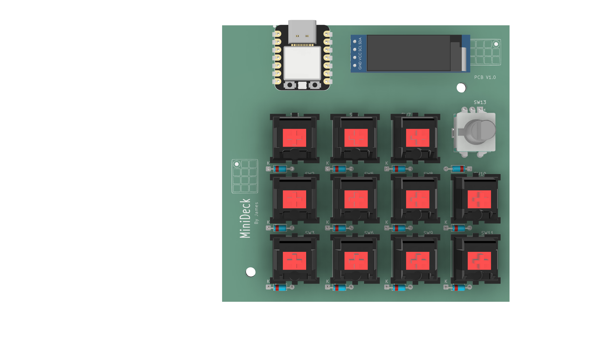
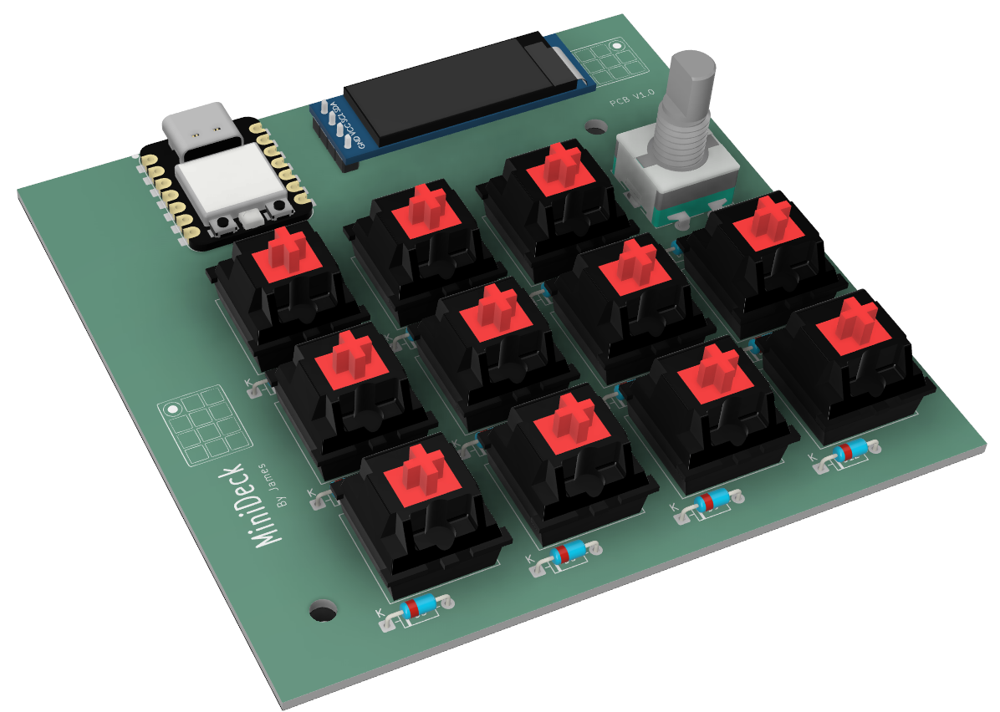
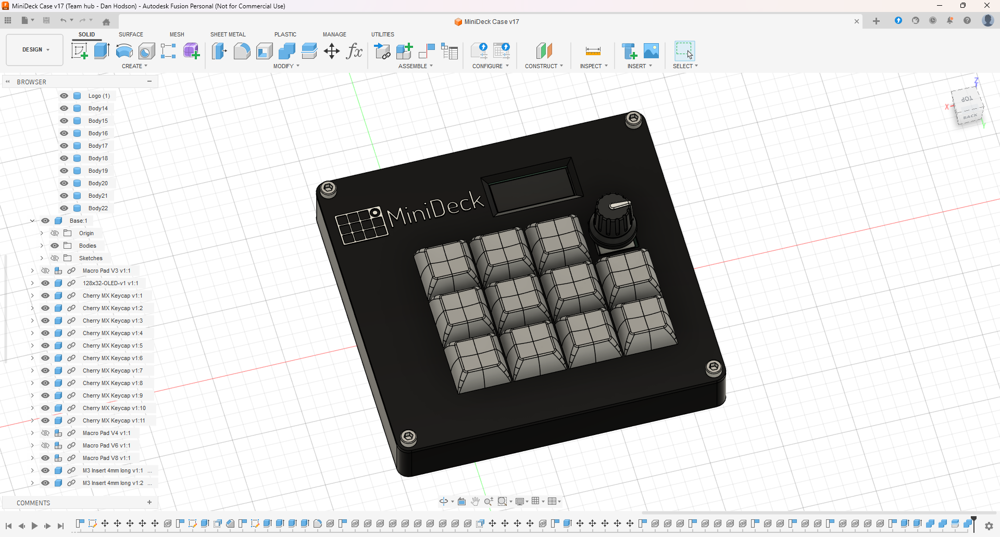
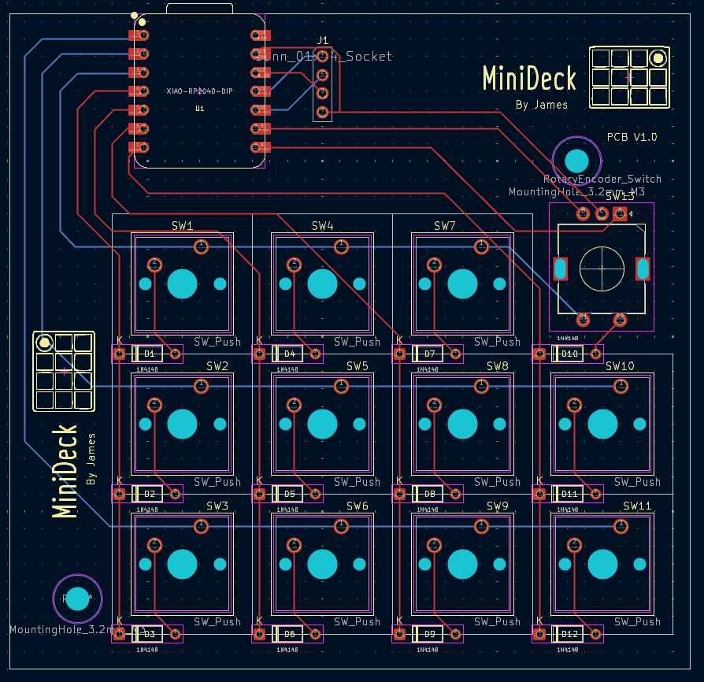
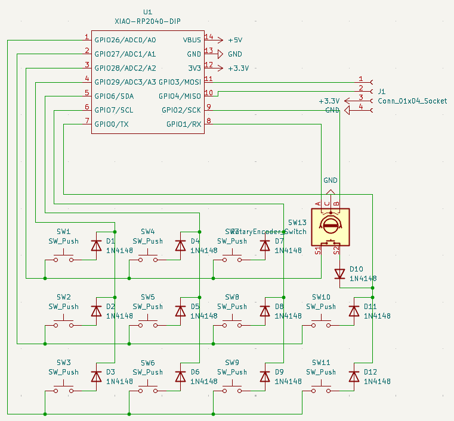

# MiniDeck  

MiniDeck is a macropad that I have designed to have a lot of functionality in a fairly small package. I wanted to build in the ability to expand its functionalty from just being a macropad to a device which can be used to control smart home devices as well.  

## Features
- 11 Mechanical Switches
- EC11 rotary encoder with push button
- 0.91" 128x32 OLED display
- Sleek case with M3 heat set inserts

## TODO
- ✅ PCB design
- ❌ KMK firmware
- ❌ QMK firmware
- ❌ HomeAssistant integration

## Renders

    
    

    
    

## CAD Model
All parts are attatches with M3x6mm bolts to make it simple and they screw into 6 M3x4mm heatset inserts. This allows the PCB to be held down with 2 bolts and the case lid 4 bolts.  

The case is printed in two parts, the base and the lid.  
  

To have the logo stand out I want to have the logo and text be white, my printer only does one colour at a time though. So to achieve the two tone design I need to add a layer pause in the slicer to allow me to change filament during this point and then let it print the last 2 layers of text in white filament.

## PCB
Here is the schematic for the PCB, which were both made in KiCAD. The silkscreen logo was made in Adobe Illustrator.  
**PCB**  
  

**Schematic**  
  

## Firmware  
I am going to use KMK firmware to start off with as im more familiar with python so it should be easier to write. However, from the research I've done there are definetly benefits to using QMK, so in the future I might release a QMK firmware version as well.  

Below is a list of the features are currently in the firmware:  
- Rotary encoder changes master system volume
- OLED Displays current volume (Only Works if the volume is exclsivley changed from the MiniDeck)
- 11 Mechanical keys are macros

I plan to add more features and use some keys as modifer keys to extend the functionality of the MiniDeck.

## BOM  
- 11x Cherry MX Switches
- 11x DSA Keycaps
- 6x M3x4mm Heatset Inserts
- 6x M3*6mm Bolts
- 12x 1N4148 Diodes
- 1x 0.91" 128x32 OLED Display
- 1x EC11 Rotary Encoder
- 1x XIAO RP2040
- 1x Top Cover (3D Printed)
- 1x Bottom Case (3D Printed)